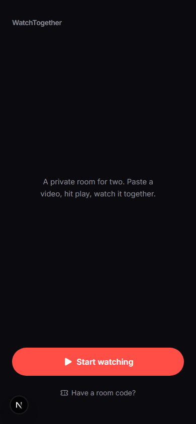
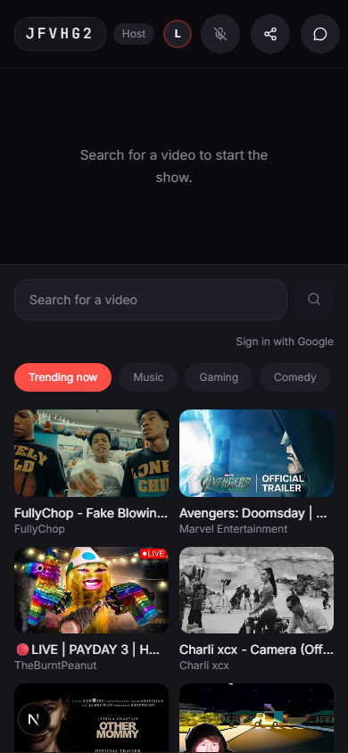
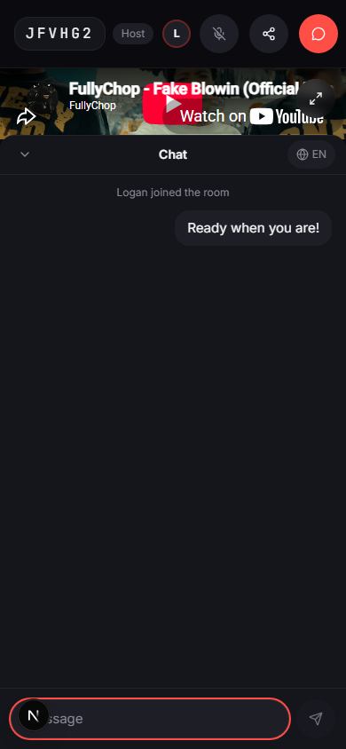

# WatchTogether

A private, two-person watch party for YouTube. Join a room, load a video, and stay perfectly in sync — play, pause, and seek all mirror instantly between both people — with live chat (auto-translated if you speak different languages) and voice chat over WebRTC.

Built as a mobile-first PWA: no install, no account, just a room code. Solo-built as a portfolio project, so the interesting part is less "it plays YouTube videos" and more everything underneath: keeping two independent video players in sync over a flaky mobile connection, translating chat live without breaking the flow, and a real-time backend that survived migrating hosting providers mid-project without any client-side rewrite.

<p align="center">
  
  
  
</p>

## How it works

```
[Phone A: host]  ⇄  Cloudflare Durable Object room (authoritative state)  ⇄  [Phone B: guest]
      │                                                                        │
      └── YouTube IFrame player ──────── (each device plays its own stream) ──┘
      └── WebRTC voice (P2P audio, signaled through the same room)
      └── Chat message → Next.js API route → Gemini translate → broadcast
```

Neither phone is the "source of truth" for playback — the room server is. Both clients send *intents* ("I pressed play at 0:42"), the server updates one authoritative state and broadcasts it, and each client reconciles its own player to match — correcting for drift every few seconds and re-syncing automatically after a phone locks its screen or loses signal for a moment.

## Stack

- **Next.js** (App Router) + TypeScript + Tailwind CSS, hosted on Vercel
- **Cloudflare Workers + Durable Objects** for the real-time room server (authoritative playback state, chat, presence, WebRTC signaling) — deployed under our own Cloudflare account, not a shared third-party host, after outgrowing an earlier provider's free-tier capacity limits mid-project
- **YouTube IFrame Player API** for video playback
- **Gemini API** for live chat translation
- **WebRTC** (peer-to-peer, no SFU) for voice chat, signaled through the same Cloudflare room

## Running it locally

Two dev servers, run side by side:

```bash
npm install
npm run dev     # Next.js, http://localhost:3000
npm run party   # the real-time room server (Wrangler), port 1999
```

You'll need a few API keys in `.env.local` (see the comments in that file for where to get each one): `GEMINI_API_KEY`, `YOUTUBE_API_KEY`, and `GOOGLE_CLIENT_ID`/`GOOGLE_CLIENT_SECRET` if you want the optional "Sign in with Google" subscriptions feed. The app works without any of them — those features just gracefully show as unavailable instead.

## A note on "Sign in with Google"

This is a small personal project, not a published/verified Google app, so signing in shows Google's standard "unverified app" warning (one extra click through "Advanced → Go to WatchTogether (unsafe)"). That's expected, not a bug — going through Google's full verification process is built for apps with real public userbases, which this deliberately isn't. It's made for exactly two people to use together, and the Google sign-in is an optional extra (browsing trending videos and pasting links both work without it).

## Deploying

- **Frontend**: push to `master`, Vercel auto-deploys.
- **Real-time server**: `npm run party:deploy` (Wrangler), then make sure `NEXT_PUBLIC_REALTIME_HOST` in Vercel's environment variables points at the deployed Worker's URL.
